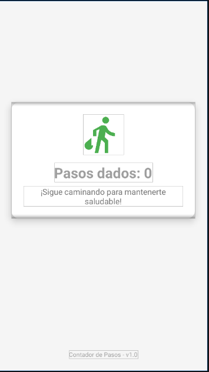

# Contador de Pasos


Una aplicación sencilla y eficiente para contar los pasos que das a lo largo del día, diseñada para ser minimalista pero visualmente atractiva.

## 📋 Descripción

**Contador de Pasos** es una aplicación Android que utiliza el sensor de conteo de pasos integrado en tu dispositivo para realizar un seguimiento preciso de tu actividad física. Diseñada con un enfoque minimalista, la aplicación se centra en proporcionar la información esencial sin complicaciones adicionales.

### Características principales

- ✅ Conteo preciso de pasos en tiempo real
- ✅ Interfaz limpia y atractiva con tema de salud
- ✅ Funciona en segundo plano con notificación persistente
- ✅ Mínimo impacto en la batería
- ✅ Compatible con múltiples versiones de Android

## 📱 Capturas de pantalla



## 🔧 Requisitos del sistema

### Para uso
- Dispositivo Android con versión 5.0 (Lollipop, API 21) o superior
- Sensor de conteo de pasos (STEP_COUNTER) incorporado en el dispositivo
- Aproximadamente 10MB de espacio libre
- Permisos requeridos:
  - ACTIVITY_RECOGNITION (para Android 10+)
  - POST_NOTIFICATIONS (para Android 13+)

### Para desarrollo
- Android Studio Arctic Fox (2020.3.1) o superior
- JDK 8 o superior
- Gradle 7.0.0 o superior
- Android SDK con API 33 (Android 13) o superior

## 🚀 Instalación

### Instalación desde APK
1. Descarga el archivo APK desde la [sección de releases](https://github.com/usuario/contador-pasos/releases)
2. En tu dispositivo Android, habilita la instalación desde fuentes desconocidas en Configuración > Seguridad
3. Abre el archivo APK descargado e instala la aplicación
4. Sigue las instrucciones en pantalla para otorgar los permisos necesarios

### Compilación desde código fuente

1. Clona el repositorio:
```bash
git clone https://github.com/usuario/contador-pasos.git
```

2. Abre el proyecto en Android Studio:
   - Inicia Android Studio
   - Selecciona "Abrir un proyecto existente"
   - Navega hasta la carpeta donde clonaste el repositorio y selecciónala

3. Sincroniza Gradle:
   - Android Studio debería sincronizar el proyecto automáticamente
   - Si no lo hace, haz clic en "Sync Now" en la notificación que aparece

4. Compila el proyecto:
   - Selecciona Build > Make Project

5. Ejecuta la aplicación:
   - Conecta un dispositivo Android habilitado para depuración o usa un emulador
   - Selecciona Run > Run 'app'

## 📁 Estructura del proyecto

```
contador-pasos/
├── app/
│   ├── src/
│   │   ├── main/
│   │   │   ├── java/
│   │   │   │   └── com/
│   │   │   │       └── example/
│   │   │   │           └── stepcounter/
│   │   │   │               ├── MainActivity.kt         # Actividad principal
│   │   │   │               └── StepCounterService.kt   # Servicio para contar pasos
│   │   │   ├── res/
│   │   │   │   ├── drawable/
│   │   │   │   │   └── ic_footsteps.xml               # Icono de pasos
│   │   │   │   ├── layout/
│   │   │   │   │   └── activity_main.xml              # Layout principal
│   │   │   │   └── values/
│   │   │   │       ├── colors.xml                     # Definición de colores
│   │   │   │       └── strings.xml                    # Textos en español
│   │   │   └── AndroidManifest.xml                    # Configuración del manifiesto
│   │   └── ...
│   ├── build.gradle                                  # Configuración de Gradle para el módulo
│   └── ...
├── build.gradle                                      # Configuración de Gradle para el proyecto
└── ...
```

## 🛠️ Uso de la aplicación

1. Inicia la aplicación
2. Otorga los permisos solicitados cuando se te pidan
3. La aplicación comenzará a contar tus pasos automáticamente
4. La interfaz mostrará el número de pasos dados
5. El conteo continuará incluso si la aplicación está en segundo plano o el dispositivo está bloqueado

## ⚙️ Personalización

Si deseas personalizar la aplicación, puedes modificar los siguientes archivos:

- `colors.xml`: Para cambiar los colores de la aplicación
- `strings.xml`: Para modificar los textos mostrados
- `activity_main.xml`: Para ajustar el diseño de la interfaz

## 📝 Notas importantes

- El conteo de pasos se reinicia cada vez que el dispositivo se reinicia o cuando la aplicación se cierra completamente
- El consumo de batería es mínimo ya que la aplicación utiliza el sensor de baja potencia del dispositivo
- La precisión del conteo puede variar según el dispositivo y las condiciones de uso

## 👥 Contribuciones

Las contribuciones son bienvenidas. Para contribuir:

1. Haz un fork del proyecto
2. Crea una rama para tu función (`git checkout -b feature/amazing-feature`)
3. Haz commit de tus cambios (`git commit -m 'Add some amazing feature'`)
4. Haz push a la rama (`git push origin feature/amazing-feature`)
5. Abre un Pull Request

## 📄 Licencia

Este proyecto está licenciado bajo la Licencia MIT - ver el archivo [LICENSE](LICENSE) para más detalles.

---

⭐️ ¡Gracias por utilizar Contador de Pasos! ⭐️
  
